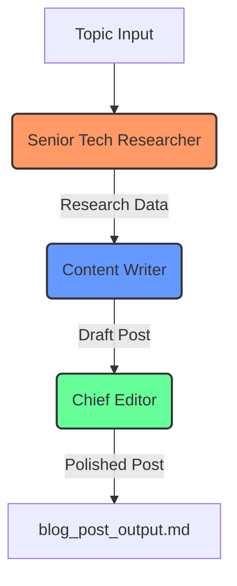

# CrewAI Blog Writer 🚀

An autonomous AI agent crew that researches, writes, and edits professional blog posts. This project uses **CrewAI** to orchestrate multiple AI agents and **Groq** to provide high-speed, free-tier LLM processing using Llama 3.

## 📋 Table of Contents
- [Features](#features)
- [How It Works](#how-it-works)
- [Setup & Installation](#setup--installation)
- [Usage](#usage)
- [File Structure](#file-structure)

## ✨ Features
- **Multi-Agent Collaboration**: Features a Researcher, a Writer, and an Editor working in sequence.
- **Free to Use**: Configured to use Groq's free tier (Llama 3.1 8B).
- **Automated Research**: Gathers the latest trends and facts on any given topic.
- **Markdown Output**: Generates perfectly formatted Markdown files ready for publication.

## 🤖 How It Works
The crew operates in a sequential process where each agent's output becomes the input for the next:



1. **Senior Tech Researcher**: Uncovers groundbreaking technologies and trends.
2. **Content Writer**: Transforms research into a compelling storytelling narrative.
3. **Chief Editor**: Polishes the draft, ensures SEO optimization, and cleans up formatting.

## ⚙️ Setup & Installation

### 1. Get a Free API Key
- Go to [console.groq.com/keys](https://console.groq.com/keys).
- Create a free account and generate an API Key.

### 2. Configure Environment
- Open the `.env` file in the project folder.
- Replace the placeholder with your actual key:
  ```env
  GROQ_API_KEY=your_apiKey_here
  ```

### 3. Install Requirements
The system is set up with a virtual environment. If you need to re-install:
```bash
python -m venv venv
venv\Scripts\activate
pip install -r requirements.txt
```

## 🚀 Usage
The easiest way to run the project is using the included runner script:

1. Double-click **`run.bat`**.
2. Enter the topic you want to write about when prompted.
3. Wait for the agents to finish (you'll see the logs in the console).
4. The final blog post will be saved as **`blog_post_output.md`** in the project folder.

## 📁 File Structure
- `main.py`: The core logic defining agents and tasks.
- `.env`: Where your API keys are stored safely.
- `requirements.txt`: Python package dependencies.
- `run.bat`: A simple shortcut to run the tool.
- `blog_post_output.md`: The generated output from your last run.

## 📸 Execution Screenshots
Here is a look at the CrewAI Blog Writer in action:

### 1. Crew & Researcher Startup


### 2. Researcher Working


### 3. Writer Starting


### 4. Content Writer Output


### 5. Chief Editor Formatting


### 6. Final Polished Result


---
Built with [CrewAI](https://crewai.com) and [Groq](https://groq.com).
